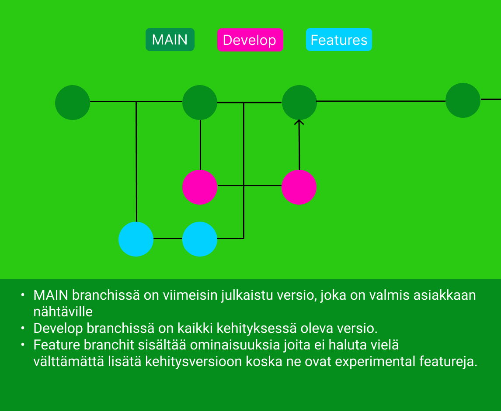

# Sivusto Ohjaus

Tämä repositorio sisältää kaikki materiaalit ja tiedot Mulufikir projektia varten.

Sivut mitkä teimme voivat nähdä `new_website` branchiltä minne voit mennä [tästä](https://github.com/Koodiluola4/sivusto-ohjaus/tree/new_website).

## Graafinen ohjeisto

### Värit

-  Leipäteksti (`#000000`)

-  Header ja footer tekstit & leipäteksti tausta (`#ffffff`)

-  Header Tausta (`#FE6099`)

-  Sisältö Laatikko (`#19C89C`)

-  Footer Tausta (`#1A9778`)

### Fontti

Fontti mitä käytämme on Khand.

### Logo

    

### Flyer

    
    

### Rautalanka malli (Figma)

[Tästä](http://gg.gg/shortlink1dxd) voit nähdä meidän rautalanka mallin (tarvitsee oikeudet)

## Sivuston hostaus 🌐

Valitsimme hosting palveluksi Hetzner Cloud CX21 palvelimen (€ 6.37 / kk)

Koska sivustonen hostaus on tärkeää valitsimme pari eri vaihto ehtoa mitkä ovat listattu alas ja sitten kerromme mikä niisrä on paras ja selitämme sen.

| Tarjoaja  | Hinta               | Linkki                                                       |
|-----------|---------------------|--------------------------------------------------------------|
| Hetzner   | Alk. 4,51$/Kuukausi | [Hetzner](https://www.hetzner.com/cloud)                    |
| OVH       | Alk. 4,20$/Kuukausi | [OVH](https://www.ovhcloud.com/en/vps/)                     |
| Hostinger | Alk. 3,95$/Kuukausi | [Hostinger](https://www.hostinger.fi/vps-virtuaalipalvelin) |

Lopulta valitsimme Hetznerin hostaus tarjoajaksi syistä mitkä ovat listattu alapuolelle.

- Hetznerillä on myös palvelimia suomessa, joka mahdollistaa kaikki suomen ja Euroopan internetti turvallisuus lakien noudutuksen. 

- Hetzner on yksi maailman tunnetuimista ja luotetuimmista palvelimen tarjoojista.

- Hetznerin hinnat ovat todella kilpailu kykyisiä verrattuna samantapaisiin palvelimen tarjoajiin. 

- Palvelimen maksua pystyy maksamaan kolmen kuukauden tai jopa vuoden erissä, jotta teidän ei tarvitse muistaa maksaa joka kuukausi palvelimesta. 

- Hetzner myös muistuttaa sähköpostilla palvelimen maksusta, jotta et unohda maksaa sitä.

- Hetzner on kilpailu kykyinen palvelimen tarjoaja, joka pystyy tarjoamaan halvimmat hinnat, koska he ovat olleet markkinoilla todella kauan. 

# 24.11.2022

### Facebook sivu saatiin tehtyä  📲
- Banneri kuva valmiinna
- Tehtiin profiili kuva
- 
### Flyer on päivitetty paremmaksi   📃
- Kuvan vaihto
- Pallojen lisääminen
- Yhteystiedot lisätty learn more osioon
- Facebook lisätty yhteystietoihin
- Vaihdettiin tekstiä parempaan

# 25.11.2022

### tehdään wordpress testi sivua 📰
-
### yritetään saada upotettua google maps tyyppinen kartta  🗺

### ### END OF THE MULUFIKIR PROJECT \###

## How to use Git

## Deprecated files

Vanhoja testejä, yrityksiä, kuvia, materiaalia voi löytää [Täältä](https://github.com/Koodiluola4/sivusto-ohjaus/tree/master/materiaali/deprecated)
